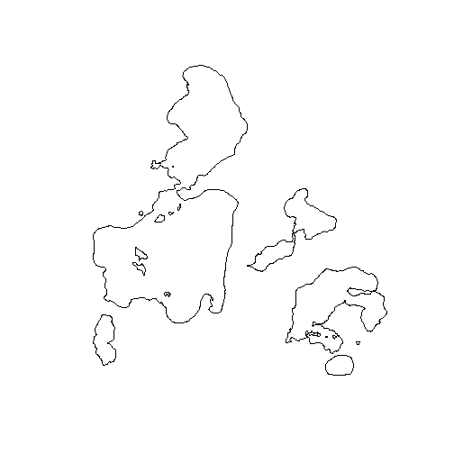

 
# Demo: Making maps
Now that we have all the infrastructure packages dealt with, we can read spatial data into R, do GISy type things to that data, and write those results out to other data formats.  We haven't talked about creating maps yet.  There are many ways we can do this, but we will focus on three: default plotting, static maps with `ggplot2`, and interactive maps with `mapview`.

## Lesson Outline
- [Get some data](#get-some-data)
- [Default plotting](#default-plotting)
- [Maps with `mapview`](#maps-with-mapview)
- [Maps with `ggplot2`](#maps-with-ggplot2)

## Get some data
There are a lot of fancy ways to get spatial data into R (e.g. packages that wrap web APIs), but for this demo we will start simple and download a shapefile to our local machine.  I am new to Trout Lake, so I thought it would be fun to start here and get a few data layers about Trout Lake and make a map of those.  The code below that should get you set up with two shapefiles on your local machine. 

Before we do this, thought it is best to be working in project in RStudio.  For today we will just do this, but I encourage you to take a read of any of these excellent resources.  

- [Using Projects: RStudio Support](https://support.rstudio.com/hc/en-us/articles/200526207-Using-Projects)
- [Workflow Chapter in R for Data Science](https://r4ds.had.co.nz/workflow-projects.html)
- [Software Carpentry Project Management Lesson](https://swcarpentry.github.io/r-novice-gapminder/02-project-intro/)
- [What they forgot to teach you about R - Project Oriented Workflows](https://whattheyforgot.org/project-oriented-workflow.html)

But for now, lets create a new project in RStudio.  

1. Go to File: New Project: New Directory: New Project.  
2. In the dialog box for "Directory name:" put "rspatial_workshop". This will open up your new project.  
3. In your newly created project (which should be open in RStudio now), go to File: New File and choose R Script.
4. When that blank new R Script opens up, save it as "map_demo.R"

Let's now add code to get some data.


```r
lakes_url <- "https://github.com/jhollist/troutlake_rspatial/raw/master/data/ntl135_v2.zip"
bathy_url <- "https://github.com/jhollist/troutlake_rspatial/raw/master/data/nhld_bathymetry_v2.zip"
download.file(lakes_url, "lakes.zip")
download.file(bathy_url, "bathy.zip")
unzip("lakes.zip")
unzip("bathy.zip")
```

Now that we have local data, we can create some R objects by reading in the shapefiles with the `sf` package.


```r
library(sf)
ntl_lakes <- st_read("nhld_study_lakes.shp")
```

```
## Reading layer `nhld_study_lakes' from data source `C:\Users\JHollist\OneDrive - Environmental Protection Agency (EPA)\projects\troutlake_rspatial\lessons\nhld_study_lakes.shp' using driver `ESRI Shapefile'
## Simple feature collection with 7 features and 9 fields
## geometry type:  POLYGON
## dimension:      XY
## bbox:           xmin: 542911.1 ymin: 614036.2 xmax: 551299.8 ymax: 622892.5
## epsg (SRID):    NA
## proj4string:    +proj=tmerc +lat_0=0 +lon_0=-90 +k=0.9996 +x_0=520000 +y_0=-4480000 +ellps=GRS80 +towgs84=0,0,0,0,0,0,0 +units=m +no_defs
```

```r
# The NTL zip file had an extra folder in it, so we need to point to 
# the correct path here...
ntl_bathy <- st_read("nhld_bathymetry/nhld_bathymetry.shp")
```

```
## Reading layer `nhld_bathymetry' from data source `C:\Users\JHollist\OneDrive - Environmental Protection Agency (EPA)\projects\troutlake_rspatial\lessons\nhld_bathymetry\nhld_bathymetry.shp' using driver `ESRI Shapefile'
## Simple feature collection with 259 features and 4 fields
## geometry type:  POLYGON
## dimension:      XY
## bbox:           xmin: 542990.7 ymin: 614026.5 xmax: 551283.3 ymax: 622878
## epsg (SRID):    NA
## proj4string:    +proj=tmerc +lat_0=0 +lon_0=-90 +k=0.9996 +x_0=520000 +y_0=-4480000 +datum=NAD83 +units=m +no_defs
```

## Default plotting
Default plotting methods exist within each of the major spatial packages listed above which allows us to use the  `plot()` function to create a simple plot of our spatial data.  Let's take a look at the NTL Lakes:


```r
plot(st_geometry(ntl_lakes))
```



And then we can add the bathymetry:


```r
plot(st_geometry(ntl_lakes))
plot(st_geometry(ntl_bathy), add = TRUE, border = ntl_bathy$Depth_ft)
```


This kind of map is useful (in spite of this particular map being ugly) when you want to just take a quick peek at the data to make sure it passes the laugh test, but for something more useful we need to look beyond the default plotting.  

## Maps with `mapview`
The `mapview` package provides a lot of additional functionality on top of the default plotting.  It uses the `leaflet` package but makes it easier to build some quick maps.  By using leaflet, we get all that great web map functionality (pan, zoom, base maps) plus we can interact with the data visually.  Let's do the same map we did above, but with `mapview` instead. 


```r
library(mapview)
mapview(ntl_lakes) + mapview(ntl_bathy, zcol = "Depth_ft")
```


Well, that's an improvement!  We can zoom, pan, select, turn on and off layers, etc.  This is the package I use the most to interact with my spatial data.  But, when I need to make figures for presentations or papers, I usually turn to the old standby for data viz in R, `ggplot2`.  Let's work on creating a static map with `ggplot2`

## Maps with `ggplot2`
The *de facto* package for data visualization in R is `ggplot2`.  Given it's ubiquity for creating static figures, it is nice that we can build on this functionality to create maps in R as well. Plus, let's get a little more in depth and manipulate our spatial data as well.  I originally said that we were going to create a map of Trout Lake.  Let's work on that. 

So, let's start with filtering out Trout Lake from the other lakes and limiting the contours that we display to every 20 ft but without the 0 depth contour. 


```r
library(dplyr)
trout_lake <- ntl_lakes %>%
  filter(LAKE_NAME == "Trout Lake")

trout_lake_bathy <- ntl_bathy %>%
  filter(LakeID == "TR") %>%
  filter(Depth_ft > 0) %>%
  filter(Depth_ft %% 20 == 0) %>%
  st_transform(crs = st_crs(trout_lake))
```

With those filtered out, we can now work on making our map.  First, the lake.


```r
library(ggplot2)
ggplot(trout_lake) +
  geom_sf()
```


Nice!  Let's add in the bathymetry with the lines colored by depth.


```r
tl_map <- ggplot(trout_lake) +
  geom_sf() +
  geom_sf(data = trout_lake_bathy, aes(colour = Depth_ft))
tl_map
```


Getting there...  Those colors are hard for me and my old eyes to differentiate.  Let's use something that has research backing up its color palette, Viridis!  And while we are at it, we can make the shoreline standout a bit from the bathymetry and clean up our overall look and feel.


```r
tl_map <- ggplot(trout_lake) +
  geom_sf(size = 1, color = "black", fill = "steelblue4", alpha = 0.3) +
  geom_sf(data = trout_lake_bathy, aes(colour = Depth_ft), fill = NA, size = 0.75) +
  scale_colour_viridis_c() + 
  labs(title = "Trout Lake Batyhmetry") +
  theme_bw() +
  theme(plot.title = element_text(hjust = 0.5))
tl_map
```


Could probably use a bit more cleaning up, but for the most part looks pretty good!

Lastly, let's save it to a file to include in our presentations and manuscripts!


```r
ggsave("tl_bathymetry_map.jpg", tl_map, width = 8.5, height = 11, units = "in", 
       dpi = 300)
```


