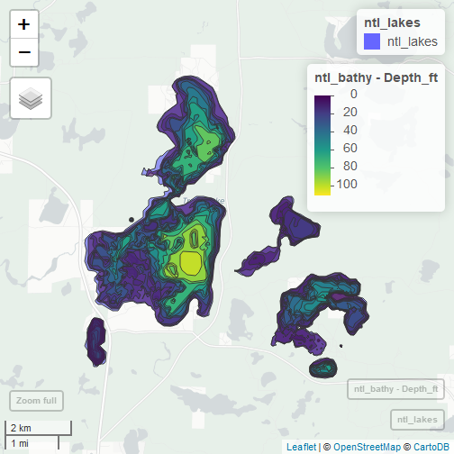

 
# Demo: Making maps
Now that we have all the infrastructure packages dealt with, we can read spatial data into R, do GISy type things to that data, and write those results out to other data formats.  We haven't talked about creating maps yet.  There are many ways we can do this, but we will focus on three: default plotting, static maps with `ggplot2`, and interactive maps with `mapview`.

## Lesson Outline
- [Get some data](#get-some-data)
- [Default plotting](#default-plotting)
- [Maps with `ggplot2`](#maps-with-ggplot2)
- [Maps with `mapview`](#maps-with-mapview)

## Get some data
There are a lot of fancy ways to get spatial data into R (e.g. packages that wrap web APIs), but for this demo we will start simple and download a shapefile to our local machine.  I am new to Trout Lake, so I thought it would be fun to start here and get a few data layers about Trout Lake and make a map of those.  The code below that should get you set up with two shapefiles on your local machine. 


Now that we have local data, we can create some R objects by reading in the shapefiles with the `sf` package.


```r
library(sf)
ntl_lakes <- st_read("nhld_study_lakes.shp")
```

```
## Reading layer `nhld_study_lakes' from data source `C:\Users\JHollist\OneDrive - Environmental Protection Agency (EPA)\projects\troutlake_rspatial\lessons\nhld_study_lakes.shp' using driver `ESRI Shapefile'
## Simple feature collection with 7 features and 9 fields
## geometry type:  POLYGON
## dimension:      XY
## bbox:           xmin: 542911.1 ymin: 614036.2 xmax: 551299.8 ymax: 622892.5
## epsg (SRID):    NA
## proj4string:    +proj=tmerc +lat_0=0 +lon_0=-90 +k=0.9996 +x_0=520000 +y_0=-4480000 +ellps=GRS80 +towgs84=0,0,0,0,0,0,0 +units=m +no_defs
```

```r
# The NTL zip file had an extra folder in it, so we need to point to 
# the correct path here...
ntl_bathy <- st_read("nhld_bathymetry/nhld_bathymetry.shp")
```

```
## Reading layer `nhld_bathymetry' from data source `C:\Users\JHollist\OneDrive - Environmental Protection Agency (EPA)\projects\troutlake_rspatial\lessons\nhld_bathymetry\nhld_bathymetry.shp' using driver `ESRI Shapefile'
## Simple feature collection with 259 features and 4 fields
## geometry type:  POLYGON
## dimension:      XY
## bbox:           xmin: 542990.7 ymin: 614026.5 xmax: 551283.3 ymax: 622878
## epsg (SRID):    NA
## proj4string:    +proj=tmerc +lat_0=0 +lon_0=-90 +k=0.9996 +x_0=520000 +y_0=-4480000 +datum=NAD83 +units=m +no_defs
```

## Default plotting
Default plotting methods exist within each of the major spatial packages listed above which allows us to use the  `plot()` function to create a simple plot of our spatial data.  Let's take a look at the NTL Lakes:


```r
plot(st_geometry(ntl_lakes))
```


And then we can add the bathymetry:


```r
plot(st_geometry(ntl_bathy), add = TRUE, border = ntl_bathy$Depth_ft)
```

```
## Error in polypath(p_bind(x[[i]]), border = border[i], lty = lty[i], lwd = lwd[i], : plot.new has not been called yet
```

This kind of map is useful (in spite of this particular map being ugly) when you want to just take a quick peek at the data to make sure it passes the laugh test, but for something more useful we need to look beyond the default plotting.  

## Maps with `mapview`
The `mapview` package provides a lot of additional functionality on top of the default plotting.  It uses the `leaflet` package but makes it easier to build some quick maps.  By using leaflet, we get all that great web map functionality (pan, zoom, base maps) plus we can interact with the data visually.  Let's do the same map we did above, but with `mapview` instead. 




```r
mapview(ntl_lakes) + mapview(ntl_bathy, zcol = "Depth_ft")
```


Well, that's an improvement!  We can zoom, pan, select, turn on and off layers, etc.  This is the package I use the most to interact with my spatial data.  But, when I need to make figures for presentations or papers, I usually turn to the old standby for data viz in R, `ggplot2`.  Let's work on creating a static map with `ggplot2`

## Maps with `ggplot2`


