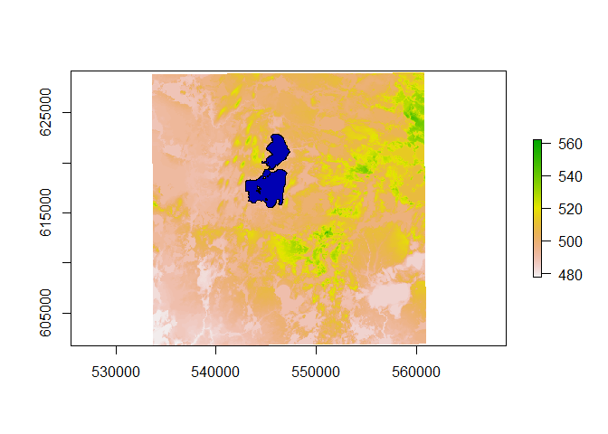

# Demo: Lake morphometry in R

## Lesson Outline

  - [New script](#new-script)
  - [Required packages](#required-packages)
  - [Revisit our data](#revisit-our-data)
  - [Get elevation data](#get-elevation-data)
  - [Calculate Trout Lake
    morphometry](#calculate-trout-lake-morphometry)

## New script

We still should be working in the “rspatial\_workshop” project we
created in the map demo. For this demo, we will create another new
script.

1.  Go to File: New File: R Script.  
2.  When that empty new file opens up, save it as “lakemorpho\_demo.R”

## Required packages

We will need to add our required packages to the top of our script.

``` r
library(raster)
library(dplyr)
library(sf)
library(lakemorpho)
library(elevatr)
```

## Revisit our data

Just to make sure we have everything loaded up again and working let’s
add some code to read in the spatial data we have already downloaded.

``` r
trout_lake <- st_read("nhld_study_lakes.shp") %>% 
  filter(LAKE_NAME == "Trout Lake")
```

    ## Reading layer `nhld_study_lakes' from data source `C:\Users\JHollist\OneDrive - Environmental Protection Agency (EPA)\projects\troutlake_rspatial\lessons\nhld_study_lakes.shp' using driver `ESRI Shapefile'
    ## Simple feature collection with 7 features and 9 fields
    ## geometry type:  POLYGON
    ## dimension:      XY
    ## bbox:           xmin: 542911.1 ymin: 614036.2 xmax: 551299.8 ymax: 622892.5
    ## epsg (SRID):    NA
    ## proj4string:    +proj=tmerc +lat_0=0 +lon_0=-90 +k=0.9996 +x_0=520000 +y_0=-4480000 +ellps=GRS80 +towgs84=0,0,0,0,0,0,0 +units=m +no_defs

``` r
trout_lake_bathy <- st_read("nhld_bathymetry/nhld_bathymetry.shp") %>%
  filter(LakeID == "TR")
```

    ## Reading layer `nhld_bathymetry' from data source `C:\Users\JHollist\OneDrive - Environmental Protection Agency (EPA)\projects\troutlake_rspatial\lessons\nhld_bathymetry\nhld_bathymetry.shp' using driver `ESRI Shapefile'
    ## Simple feature collection with 259 features and 4 fields
    ## geometry type:  POLYGON
    ## dimension:      XY
    ## bbox:           xmin: 542990.7 ymin: 614026.5 xmax: 551283.3 ymax: 622878
    ## epsg (SRID):    NA
    ## proj4string:    +proj=tmerc +lat_0=0 +lon_0=-90 +k=0.9996 +x_0=520000 +y_0=-4480000 +datum=NAD83 +units=m +no_defs

We won’t be using the bathymetry in this analysis (those tools
(e.g. hypsographic curves) are a future enhancement to `lakemorpho`, I
hope), but we will load it up so we can check some numbers later…

## Get elevation data

There are many sources for elevation data. The `elevatr` package
provides access to two currently. It returns raster DEMs from the Global
Terrain Tiles (a combination of sources) from Amazon Web Services, and
point data elevations from either the Terrain Tiles or USGS Point
Elevation Service. We are going to get the raster DEM from the area
surrounding Trout Lake. This data is used to estimate a maximum lake
depth.

``` r
trout_lake_dem <- get_elev_raster(trout_lake, z = 12, expand = 5000)
```

    ## 
    Downloading DEMs [==>------------------------]  12% eta: 13s
    Downloading DEMs [====>----------------------]  19% eta: 11s
    Downloading DEMs [======>--------------------]  25% eta: 10s
    Downloading DEMs [=======>-------------------]  31% eta:  8s
    Downloading DEMs [=========>-----------------]  38% eta:  7s
    Downloading DEMs [===========>---------------]  44% eta:  6s
    Downloading DEMs [=============>-------------]  50% eta:  6s
    Downloading DEMs [==============>------------]  56% eta:  5s
    Downloading DEMs [================>----------]  62% eta:  4s
    Downloading DEMs [==================>--------]  69% eta:  3s
    Downloading DEMs [===================>-------]  75% eta:  2s
    Downloading DEMs [=====================>-----]  81% eta:  2s
    Downloading DEMs [=======================>---]  88% eta:  1s
    Downloading DEMs [========================>--]  94% eta:  1s
    Downloading DEMs [===========================] 100% eta:  0s
    ## Merging DEMs
    ## Reprojecting DEM to original projection
    ## Note: Elevation units are in meters.
    ## Note: The coordinate reference system is:
    ##  +proj=tmerc +lat_0=0 +lon_0=-90 +k=0.9996 +x_0=520000 +y_0=-4480000 +ellps=GRS80 +towgs84=0,0,0,0,0,0,0 +units=m +no_defs

And we can take a quick look to make sure this is as we expect.

``` r
plot(trout_lake_dem)
plot(trout_lake, add = TRUE)
```

    ## Warning in plot.sf(trout_lake, add = TRUE): ignoring all but the first
    ## attribute

<!-- -->

## Calculate Trout Lake Morphometry

Now that we have spatial data for the lake itself, plus elevation data
for the surrounding landscape, we can use these in `lakemorpho` to get
our standard suite of metrics such as surface area, shoreline
development, maximum lake length, maximum depth, etc.

``` r
# Create the lakeMorpho object
trout_lake_lmorpho <- lakeSurroundTopo(as(trout_lake, "Spatial"), trout_lake_dem)
```

With the `lakeMorpho` object created, we can now run the metrics one at
a time, like:

``` r
lakeFetch(trout_lake_lmorpho, 90)
```

    ## [1] 3955.489

``` r
lakeShorelineDevelopment(trout_lake_lmorpho)
```

    ## [1] 2.314676

Or, we can take advantage of the convenience function,
`calcLakeMetrics()` and do them all in one line of code. This returns a
list so the following code calculates the metrics and also massages the
list into a more familiar data frame.

``` r
trout_lake_metrics <- calcLakeMetrics(trout_lake_lmorpho, bearing =  90, pointDens = 100, correctFactor = 1) %>%
  as.data.frame() %>%
  mutate(lake_name = "Trout Lake") %>%
  select(lake_name, everything()) %>% 
  as_tibble()
trout_lake_metrics
```

    ## # A tibble: 1 x 11
    ##   lake_name surfaceArea shorelineLength shorelineDevelo~ maxDepth volume
    ##   <chr>           <dbl>           <dbl>            <dbl>    <dbl>  <dbl>
    ## 1 Trout La~   15638241.          32448.             2.31     41.8 4.32e6
    ## # ... with 5 more variables: meanDepth <dbl>, maxLength <dbl>,
    ## #   maxWidth <dbl>, meanWidth <dbl>, fetch <dbl>

For those of you that are more familiar with Trout Lake than I am (all
of you, probably), I hope that these metrics look about right. A quick
look at the maximum depth contour makes me feel at least somewhat
confident\!

``` r
trout_lake_metrics$maxDepth
```

    ## [1] 41.78182

``` r
max(trout_lake_bathy$Depth_m)
```

    ## [1] 33.528

The simple method we used to estimate maximum depth here usually over
predicts, as it does here, but by how much will vary regionally. The
`correctionFactor` argument could be used to adjust this if we had a
regional `correctionFactor`.

That’s all for now. Hopefully this quick survey of spatial data and lake
morphometry in R was useful\!
